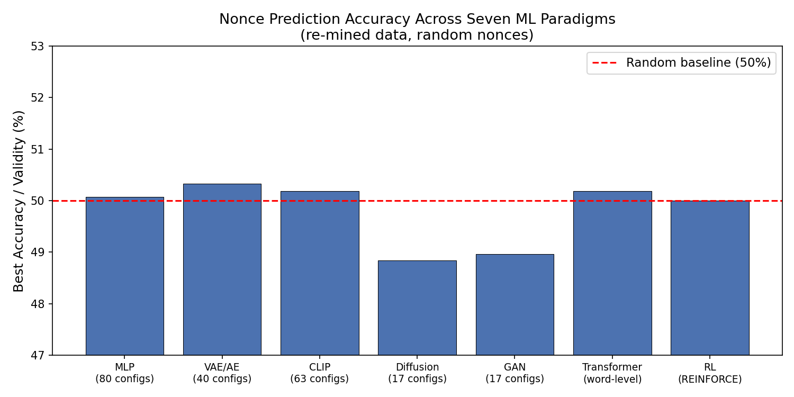
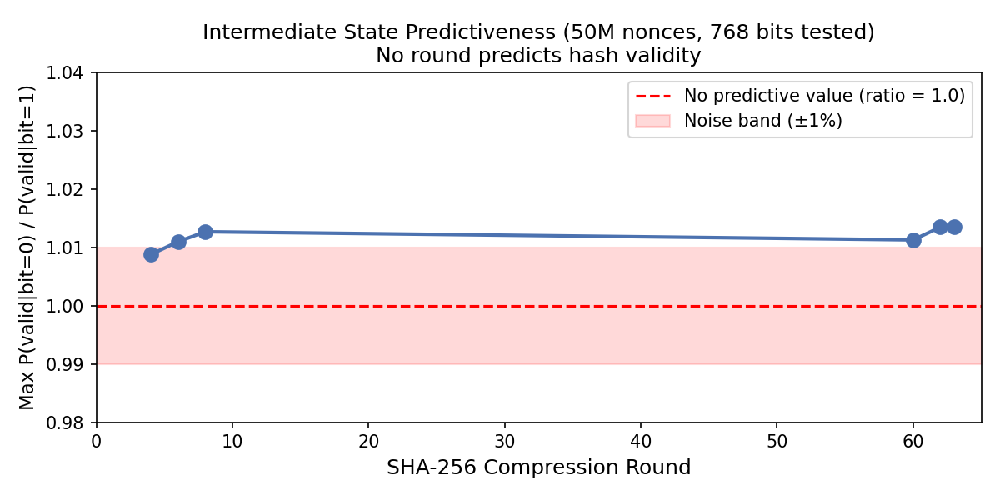
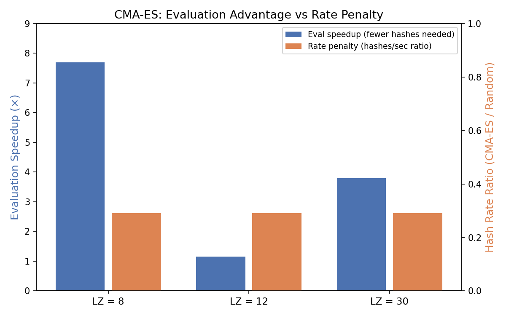

# SHA-256 Mining Analysis

**Louis Slothouber** | lpslot@gmail.com | March 2026

A large-scale empirical investigation into whether any algorithmic improvement to Bitcoin mining exists beyond the known [midstate](https://en.bitcoin.it/wiki/Midstate) and [AsicBoost](https://arxiv.org/abs/1604.00575) optimizations. Across SAT solving, seven machine learning architectures, evolutionary search, and structural analysis of SHA-256, no method tested showed improvement over brute-force search. Results are consistent with SHA-256 behaving as an unstructured search problem at the mining interface.

**This work does not prove impossibility.** It provides broad empirical evidence across multiple paradigms that no exploitable structure was detected under the conditions tested.

Experiments and analysis were performed using [Claude Code](https://claude.ai/claude-code) (Anthropic). [AutoResearch](https://github.com/karpathy/autoresearch) methodology by Andrej Karpathy — automated hyperparameter search and model selection — employed to rapidly evaluate 300+ ML configurations across seven architecture classes.

## Paper

**[Algorithmic Approaches to SHA-256 Bitcoin Mining: An Empirical Analysis](paper/sha256-mining-ml-analysis.md)**

Twelve results with full methodology for independent reproduction. AI peer-reviewed prior to release.

## Key Findings

1. **SAT solvers** (CDCL, CryptoMiniSat, Cutting Planes) do not beat brute force
2. **Neural networks** (139M parameters) cannot learn to approximate SHA-256 in the forward direction
3. **Seven ML paradigms** (MLP, VAE, CLIP, diffusion, GAN, RL, transformer) detect no nonce–header dependence with random nonces
4. **Real Bitcoin nonces** have rich but non-cryptographic structure (mining pool conventions)
5. **No intermediate SHA-256 state** predicts hash validity (50M-sample test, 768 state bits)
6. **Valid nonces** are consistent with uniform distribution — no clustering or easy headers
7. **CMA-ES** requires 3.8× fewer evaluations but 3.4× slower per evaluation (net ≈1.1×)
8. **Message schedule sparsity** is minimal (2/48 expanded words nonce-independent)
9. **AND-gate density** (48K gates, 73.7% from carry chains) provides heuristic measure of inversion difficulty
10. **Three structural barriers** (parity, carry chains, coupling) make SAT empirically intractable
11. **No known quantum algorithm** exceeds Grover's quadratic bound for SHA-256 mining
12. **Double SHA-256** exhibits super-linear SAT coupling penalty

## Figures

### ML Architecture Comparison

*All seven ML paradigms tested on re-mined data with random nonces. No architecture exceeds the 50% random baseline.*

### Intermediate State Predictiveness

*50 million nonces tested. The maximum conditional probability ratio across 768 state bits never exceeds noise levels at any compression round.*

### CMA-ES: Evaluation Advantage vs Rate Penalty

*CMA-ES requires fewer hash evaluations (blue) but runs slower per evaluation (orange). The advantages approximately cancel in wall-clock time.*

## Paper Results → Code

| Paper Result | Script | Description |
|---|---|---|
| Result 1 (SAT) | *(SAT encoders in main project)* | CNF encoding, solver benchmarks |
| Result 2 (Neural approximation) | `src/ml_experiments/tier2_new_directions.py` | 139M-param hash approximation |
| Result 3 (ML independence) | `src/ml_experiments/mlp_autoresearch.py`, `reduced_round_ml.py`, `phase3_*.py` | Seven architectures, eight round counts |
| Result 4 (Miner behavior) | `src/ml_experiments/d1_nonce_analysis.py`, `speedup_benchmark.py` | Nonce structure, feature importance, validity test |
| Result 5 (Intermediate state) | `src/structural_analysis/crack4_algebraic.c`, `partial_eval_test.c` | 50M-sample state bit correlation |
| Result 6 (Nonce uniformity) | `src/search_strategies/near_miss_test.py`, `src/structural_analysis/header_optimization.c` | Clustering, near-miss, cross-header variance |
| Result 7 (CMA-ES) | `src/search_strategies/evolutionary_mining.py`, `cmaes_large_scale.py`, `src/structural_analysis/cmaes_64lz.c` | Evaluation advantage vs rate penalty |
| Result 8 (Schedule sparsity) | `src/structural_analysis/divide_and_conquer_analysis.py` | Dependency graph analysis |
| Result 9 (AND-gate density) | `src/structural_analysis/divide_and_conquer_analysis.py` | Gate counting, carry chain analysis |
| Result 10 (SAT barriers) | `src/ml_experiments/deep_investigation.py` | IPASIR-UP propagator, XOR/carry tests |
| Result 11 (Quantum) | *(theoretical — see paper)* | Grover bound + structural preconditions |
| Result 12 (Double hash) | *(SAT encoders in main project)* | Double SHA-256 coupling benchmark |

## Quick Start

### 1. Download Bitcoin block headers (~100 seconds)

```bash
pip install numpy torch
python src/data_acquisition/bitcoin_headers_electrum.py --sandbox .
```

This downloads 940K+ real headers via the Electrum protocol (no API key needed).

### 2. Run the MLP experiment (reproduces Results 3–4)

```bash
# AutoResearch: searches 80 MLP configurations, trains best to convergence
python src/ml_experiments/mlp_autoresearch.py --sandbox .
```

### 3. Run a structural analysis (reproduces Result 5)

```bash
# Compile and run 50M-sample intermediate state test
gcc -O3 -o crack4 src/structural_analysis/crack4_algebraic.c -lm
echo "$(head -1 data/test_stubs.txt)" | ./crack4 50000000
```

### 4. Run CMA-ES benchmark (reproduces Result 7)

```bash
gcc -O3 -o cmaes src/structural_analysis/cmaes_64lz.c -lm
echo "$(head -1 data/test_stubs.txt)" | ./cmaes 1000
```

## Repository Structure

```
paper/                              Research paper (Markdown)
src/
  data_acquisition/
    bitcoin_headers_electrum.py     Downloads ~940K real block headers
  ml_experiments/
    mlp_autoresearch.py             MLP hyperparameter search (80 configs)
    reduced_round_ml.py             Reduced-round ML (8 round counts)
    phase3_vae.py                   VAE/Autoencoder with shuffled + capacity controls
    phase3_clip.py                  CLIP dual-encoder (contrastive matching)
    phase3_diffusion_gan.py         Conditional diffusion + WGAN-GP
    deep_investigation.py           VAE controls, 50K power tests, high-power replication
    tier1_gaps.py                   Gap filling: R=4,5,8 + full-train diffusion/GAN
    tier2_new_directions.py         Hash approximation, word-level transformer, timestamp
    d1_nonce_analysis.py            Nonce structure characterization (temporal, MI)
    speedup_benchmark.py            Model-guided vs random search benchmark
  structural_analysis/
    divide_and_conquer_analysis.py  Precomputation boundary, nonce propagation, carry chains
    sha256_nonce_finder.c           Fast C nonce finder for reduced-round data generation
    header_optimization.c           Cross-header valid-nonce variance test
    partial_eval_test.c             Intermediate state MSB predictiveness test
    crack4_algebraic.c              50M-sample intermediate state correlation (768 bits)
    cmaes_64lz.c                    CMA-ES vs random at high difficulty (4B hashes)
  search_strategies/
    evolutionary_mining.py          CMA-ES 1D and 32D nonce search
    cmaes_large_scale.py            100-header CMA-ES benchmark
    near_miss_test.py               Near-miss gradient structure test
    overnight_experiments.py        RL (REINFORCE) + nonce clustering analysis
data/                               Generated datasets (see Data Acquisition above)
```

## Data

All datasets are generated from public blockchain data:

- **Bitcoin block headers**: Downloaded via [Electrum protocol](https://electrumx.readthedocs.io/) from public servers. No API key or account needed. ~940K headers in ~100 seconds.
- **Re-mined datasets**: Generated locally by the scripts. Real header structure with random nonce starting positions to eliminate miner behavioral bias.
- **Reduced-round datasets**: Generated by `sha256_nonce_finder` (C) for configurable SHA-256 round counts.

No pre-built datasets are included in the repository. All data can be regenerated from scratch using the provided scripts.

## Hardware

All experiments are reproducible on consumer-grade hardware:

- **GPU**: NVIDIA RTX 4070 Ti (12 GB VRAM) — ML training and evaluation
- **CPU**: Apple M4 Mac Mini — analysis, C programs, coordination
- **Compiler**: GCC 13.3 at -O3

## Future Directions

Areas not covered by this investigation that may warrant further study:

- **Formal proof complexity**: Whether SHA-256 mining admits a formal exponential lower bound in resolution or stronger proof systems remains open.
- **Non-classical computing**: Photonic or neuromorphic approaches to hash evaluation.
- **Larger neural architectures**: Models beyond 139M parameters (e.g., billion-parameter transformers) were not tested.
- **Multi-block optimization**: Exploiting structure across multiple block templates simultaneously.

## License

MIT

This research was conducted independently, on the author's own time and using personal resources. It is not affiliated with, sponsored by, or representative of any employer.

## Citation

If you use this work, please cite:

```
Slothouber, L. (2026). "Algorithmic Approaches to SHA-256 Bitcoin Mining:
An Empirical Analysis." GitHub: sha256-mining-analysis.
```
